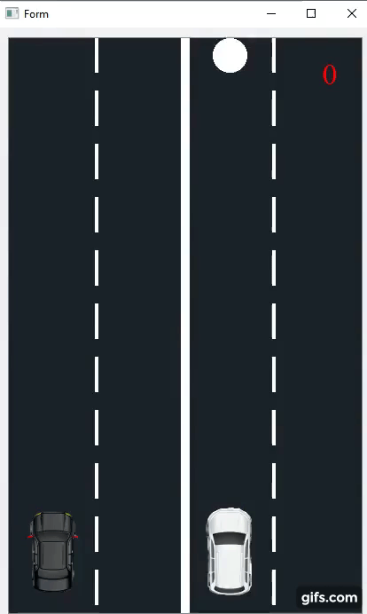

## Two_Cars_Game
The setup file for the Two Cars Game

## Two_Cars
This game is based off the "2 Cars" android game created by "Ketchapp". I decided to recreate it as a Desktop application as my Udacity C++ nanodegree Capstone Project. This is what the game looks like when launched.

The idea of the game is to avoid the Squares and not miss a single Circle.

## How to play the game:
1.  Download this repository and Launch the "Two_Cars_Setup.exe" to install the game. 

## The source code 
The source code is contained in [this repo](https://github.com/charlescookey/Two_Cars)

   

